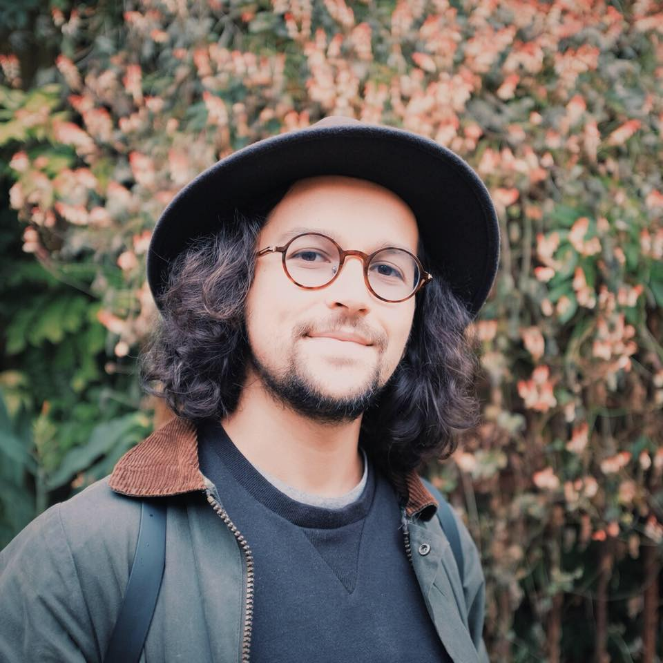

---
---

<link rel="stylesheet" href="styles.css" type="text/css">

I am a quantitative social scientist working on issues related to social norms, trust, collective action, and public opinion. My research uses survey and experimental methods to capture human behaviour in different environments and its underlying mechanisms. 

I received my Ph.D. in Sociology at [University of Essex](https://www.essex.ac.uk/departments/sociology), where I also taught the module called Models \& Measurement in Quantitative Sociology. Previously, I earned a master's degree in Longitudinal Social Research from the same institution and a bachelor degree in Economics from [Bilkent University](http://econ.bilkent.edu.tr/).

My full CV is available [here](files/BS_CV_2020.pdf).
