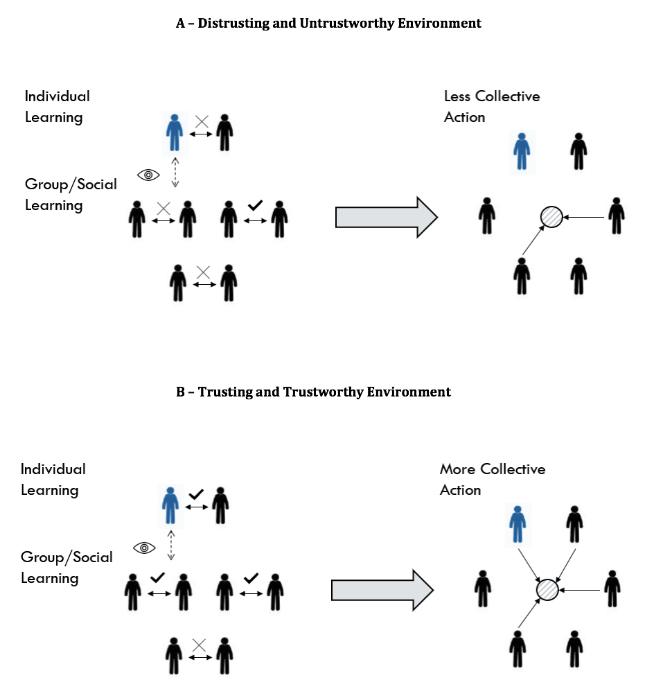

<link rel="stylesheet" href="styles.css" type="text/css">

### **Publications**

"The Effect of Trusting and Trustworthy Environments on the Provision of Public Goods." with Lo Iacono, S. 

Published in *European Sociological Review*, 2020 

*Download the article* [<ins>here</ins>](https://www.researchgate.net/profile/Sergio_Lo_Iacono/publication/345688905_The_Effect_of_Trusting_and_Trustworthy_Environments_on_the_Provision_of_Public_Goods/links/5faaccdb299bf18c5b635d27/The-Effect-of-Trusting-and-Trustworthy-Environments-on-the-Provision-of-Public-Goods.pdf) 

<a href="http://doi.org/10.1093/esr/jcaa040" target="_blank"><button>DOI</button></a>

**Abstract:** 

Trusting and trustworthy environments are argued to promote collective action, as people learn to rely on their fellow citizens and believe that only few individuals will free ride. To test the causal validity of this mechanism, we propose an experimental design that allows us to create different trusting and trustworthy conditions simply by (1) manipulating the incentive structure of an iterated binary Trust Game and (2) allowing information to flow among participants. Findings indicate that, given a similar distribution of resources among subjects, trusting and trustworthy environments strongly foster the provision of public goods. This outcome is largely driven by a learning effect: subjects transfer what they assimilate during a sequence of dyadic exchanges to their decision to act for the collectivity. In particular, results showed that what we learn from the community has a relevant effect on our ability to overcome the free rider problem: we are more likely to act for the collectivity when we learn from the community to be trustful or reliable in our one-to-one interactions. The same applies in the opposite direction: we are more prone to free ride when we learn from the environment to be distrustful or unreliable in our
dyadic exchanges.

### **Work in progress**

*"Public Perception of Scientists: Partisan vs Non-partisan Thinking." [Preregistration](https://osf.io/fe2s9) (Data collected \& manuscript in progress).*

**Abstract:**

Public opinion toward scientists differs along disciplinary, institutional, social, and political lines. We investigate whether public preferences are polarized over various features of scientists including their sex, race/ethnicity, place of work, scientific field, and political ideology. Using a conjoint survey experiment, we find that the scientific field and place of work are pronounced more compared to socio-demographics of scientists. People are also considerate about the political ideology of scientists, favouring politically independent scientists over Republicans and Democrats. However, we find that while Democrat respondents prefer politically independent scientists, Republican respondents favour only their co-partisan scientists. Knowing these preferences should urge science communicators to develop specific strategies for polarized audiences to even out preferences towards scientists.

*"Human Rights Violations and Public Support for Sanctions: Evidence from a Conjoint Experiment." with Ari, B. [Preregistration](https://osf.io/hfusz/).*

**Abstract:**

Domestic public support for taking punitive action against a human right violating country is often the main driving force for economic sanctions. However, imposing sanctions is a complex foreign policy instrument, varying greatly in effectiveness, costs on the sender and the differential harm inflicted upon the target population and leadership. How do individuals form their opinion in such a complex issue? We argue that an individual makes a multidimensional trade-off by jointly reflecting on several contextual factors that affect the perception of morality as well as the cost-benefit analysis. Based on this theoretical framework, we design a paired conjoined experiment to reveal key factors and interactions among them in understanding the preference-based third-party punishment. Our study is first to manipulate the type of human rights abuse, differential harm inflicted. 

*"Factual Information Environment and Partisanship: Public Preferences for Asylum
Seekers." with Lo Iacono, S. (Under review).* 

**Abstract:**

This project uses a lab experiment to examine how factual information on asylum seekers changes the public preferences of native citizens on policies towards asylum seeking and their related pro-social behaviour. In doing so, the study reflects on the theoretical considerations and inconsistent empirical findings on information processing. In our research, we specifically test whether factual information provision may ease or backfire unwelcoming attitudes towards asylum seeking policies along partisan lines in the UK. We further test whether factual information provision on asylum seekers improve or worsen pro-social behaviour, such as charitable giving toward asylum seekers’ wellbeing, of native-born population through the moderation of partisanship. Our results show that factual information provision by a neutral source could be an effective tool to communicate with native-born population in dealing with public biases, even though their preferred partisan identities have unfavourable views towards asylum seekers.

*"How Do Strong Family Ties Affect Trust in Different Trusting Environments?" with Ermisch, J., Gambetta, D. \& Lo Iacono, S. (Data collected \& manuscript in progress).*

**Abstract:**

The idea that having strong family ties can inhibit the development of trust in strangers was originally proposed by Toshio Yamagishi and his colleagues (1994, 1998) to explain why US citizens, members of highly mobile society, were found to be more trusting of strangers than the Japanese, who belong to a more traditional and committed society that relies on family and groups. The theoretical argument maintains that the less encompassing family ties are the more people will have an incentive to look for strangers on whom they can  rely: those with weak family ties will pursue more opportunities to interact with strangers, and be more motivated to learn from the interaction how to discern those who are trustworthy from those who are not. In this study, we first replicate the earlier study by Ermisch and Gambetta (2010) with a completely different recruitment procedure and subject pool, whose features are such as to make a link between strength of family ties and trust harder to find. Next, by manipulating the trust environment we provide an indirect test of the causal link between family ties and trust. Our evidence upholds the previous findings that strong family ties are associated with lower trust in strangers. The relationship occurs only in high-trust environment, while the intensity of family ties makes no difference in the low-trust environment in which subjects with weak family ties quickly learn to distrust strangers and their behaviour converges downward with that of subjects with strong family ties. Our ‘difference in differences’ identification strategy shows that the differential in trust between people with weak and strong ties is much larger in the high trust environment. 

*"Does Mistrust Increase Preference for Private Ordering? Evidence from an Online Experiment." with Krakowski, K. \& Lo Iacono, S. (Data collected \& manuscript in progress).*

### **Reports**

*"Integrated cross-national dataset on migration policies and recognition of foreign educational credentials. Growth, Equal Opportunities, Migration and Markets (GEMM)." with Soysal, Y., Alizade, J. \& Koopmans, R. 2018. Download the report [<ins>here</ins>](https://gemm2020.eu/?resources=report-integrated-cross-national-dataset-on-migration-policies-and-recognition-of-foreign-educational-credentials)*

You can also access my [Google scholar](https://scholar.google.nl/citations?user=dwXg2iIAAAAJ&hl=en) profile. 

